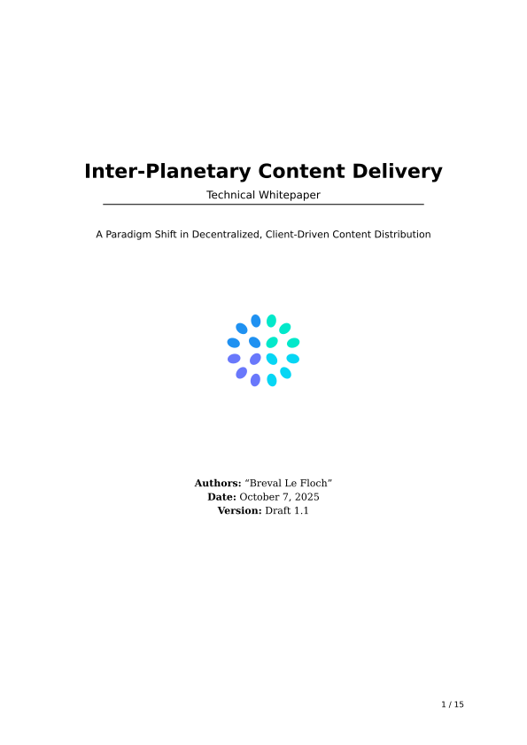
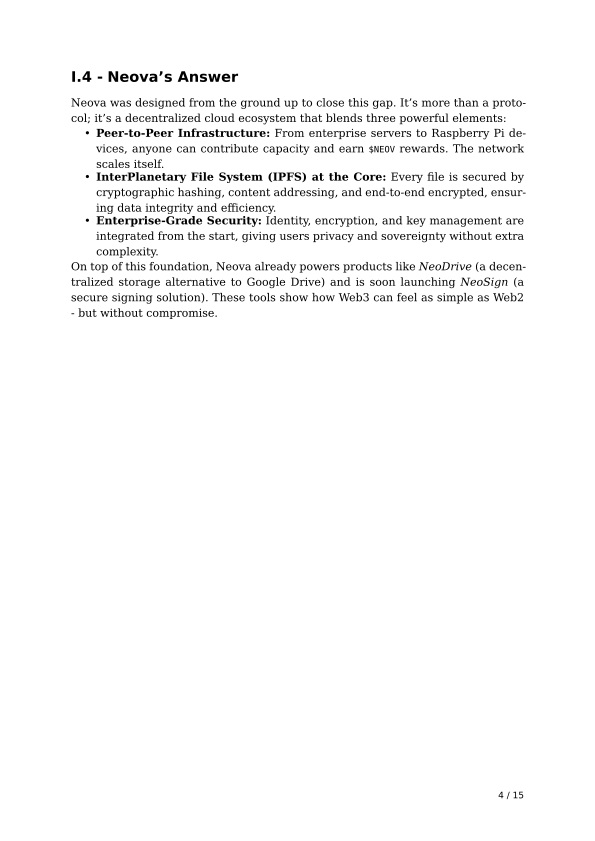
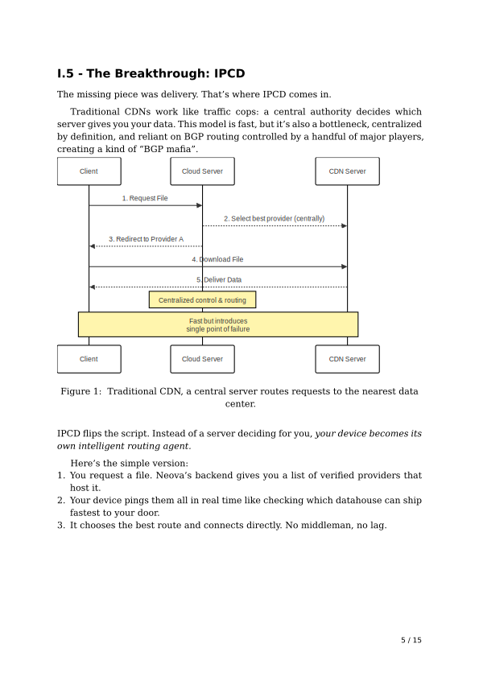
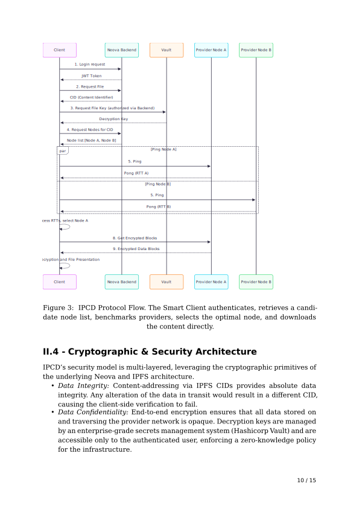
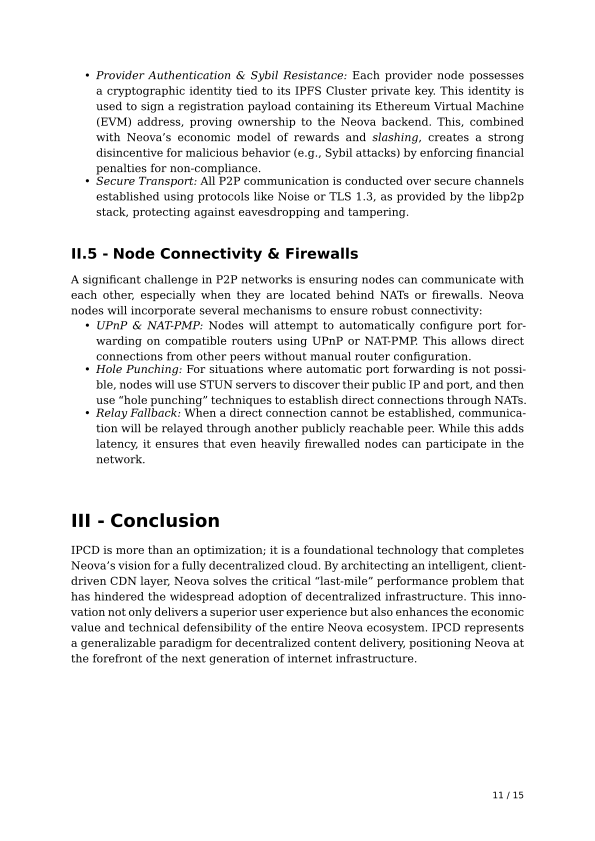
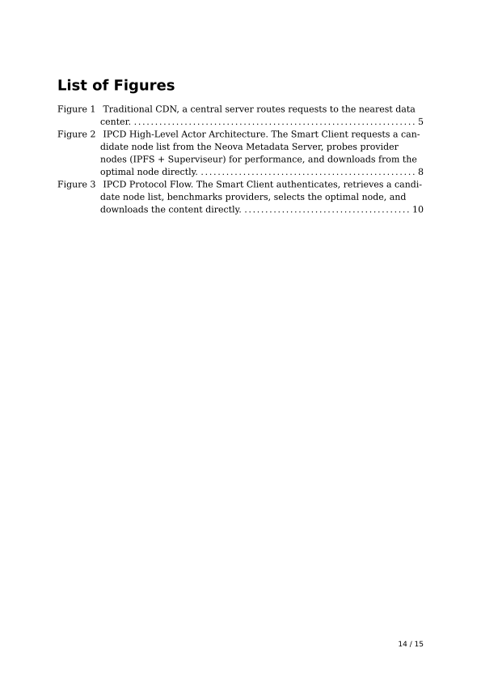
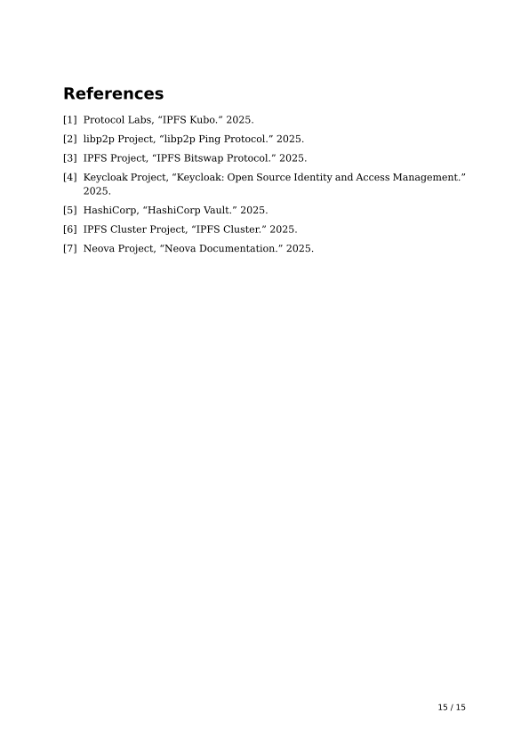

# Inter-Planetary Content Delivery (IPCD)

**Technical Whitepaper**

A client-driven performance optimization protocol for the Neova decentralized storage network, transforming it into an intelligent, native Content Delivery Network (CDN).

## Overview

IPCD transforms Neova's robust decentralized storage network into an intelligent CDN by shifting the paradigm of network routing from a centralized server-side model to a dynamic, client-driven one. By allowing clients to algorithmically benchmark and select the optimal data retrieval path in real-time, IPCD fundamentally enhances performance, fortifies network resilience, and actualizes the promise of true decentralization.

## Compiling the Document

This document is written in [Typst](https://typst.app/), a modern markup-based typesetting system.

### Prerequisites

- Install Typst: Follow the installation instructions at [https://github.com/typst/typst](https://github.com/typst/typst)

### Compilation Commands

#### Compile to PDF

```bash
typst compile main.typ main.pdf
```

#### Compile to SVG (for web display)

```bash
typst compile main.typ doc/main-{p}.svg
```

This generates separate SVG files for each page in the `doc/` folder (`doc/main-1.svg`, `doc/main-2.svg`, etc.).

#### Compile to Other Formats

**PNG (multiple pages with page numbering):**
```bash
typst compile main.typ page-{0p}-of-{t}.png
```
This creates files like `page-01-of-10.png`, `page-02-of-10.png`, etc.

**HTML:**
```bash
typst compile main.typ output.html
```

### Watch Mode

For automatic recompilation on file changes:

```bash
typst watch main.typ doc/main-{p}.svg
```

## Project Structure

```
.
├── main.typ                 # Main document file
├── glossary.typ            # Glossary definitions
├── references.bib          # Bibliography references
├── LICENSE                 # License file
├── doc/                    # Compiled document outputs
│   ├── main-1.svg         # Page 1 (SVG format)
│   ├── main-2.svg         # Page 2
│   └── ...                # Additional pages
├── assets/
│   ├── logo/              # Logo assets
│   └── schema/            # Schema diagrams
│       ├── code/          # Mermaid diagram source files
│       └── image/         # Compiled diagram images
└── content/
    └── cover.typ          # Cover page template
```

## Document Features

- Professional typography with custom fonts (Noto Serif/Sans, DejaVu Serif/Sans)
- Hierarchical heading numbering
- Automated table of contents
- List of figures
- Glossary with cross-references
- IEEE-style bibliography
- Schema diagrams and illustrations

## Document Preview

<details open>
<summary>Click to expand/collapse document pages</summary>

### Page 1 - Cover


### Page 2


### Page 3


### Page 4


### Page 5


### Page 6


### Page 7


### Page 8


### Page 9


### Page 10


### Page 11


### Page 12


### Page 13


### Page 14


### Page 15


</details>

## License
IPCD is available under the [MIT License](https://github.com/LightInn/IPCD/blob/main/LICENSE)

